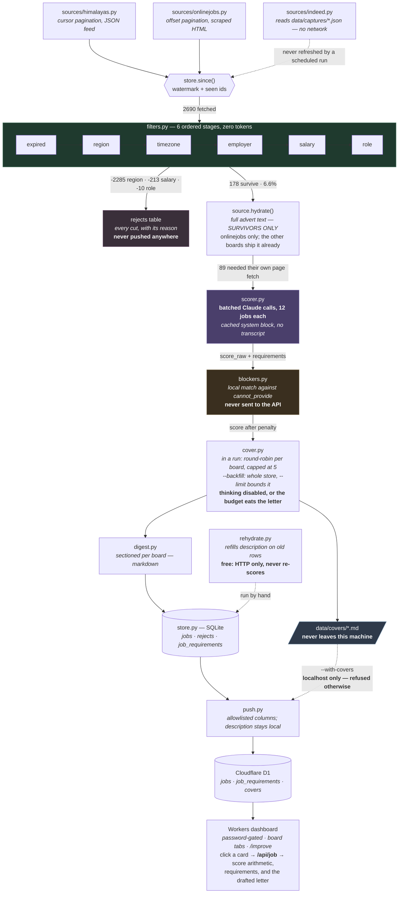

# joblist

Finds the remote jobs that will actually hire you, and pay.

Job boards are full of listings labelled "remote" that will not hire you. They
want a US resident, or an overlap with Pacific time, or they pay a local band.
Reading past those by hand is the whole cost of a job hunt.

`joblist` pulls the feed, throws away everything you are ineligible for using
the board's own structured fields, and spends a language model only on the
handful left over.

## Why it is built this way

On a measured 300-job sample from Himalayas on 2026-08-24, filtering on hiring
region and required timezone alone removed **97.7%** of listings — for zero
tokens, because those are just fields. A representative run:

```
2400 fetched  -2310 region  -1 employer  -9 salary  -66 role  14 to score
```

So the model is not a filter. It is a ranker for the ~7% that survive, and
it reads the parts a field cannot capture: a listing with an empty
`locationRestrictions` whose description turns out to be Spanish-language and
LATAM-only, or a "worldwide" role that is really a staffing agency placement.

That division is the entire design. Deterministic where the data is
trustworthy, model where it demonstrably lies. Which stages return the same
answer twice, what is free to re-run, and where the boundary is drawn is set
out in [`docs/determinism.md`](docs/determinism.md). What stops a wrong thing
from shipping, and which parts of that net are still missing, is in
[`docs/quality.md`](docs/quality.md).

### The pipeline

Every stage before `scorer.py` is deterministic and costs nothing. The model is
the last thing reached, and it only ever sees what survived.



Three things in that picture are the whole design:

- **The model sits at the bottom, not the top.** Region and timezone alone
  remove 97.7% using fields, so the expensive stage only ever reads the
  remainder. Moving work up into `scorer.py` is the v1 mistake.
- **`hydrate()` runs after the funnel, never before.** Fetching each advert's
  own page at fetch time would spend a request on every listing the salary
  floor discards for free, which is 20+ minutes at a 5s crawl delay. The cost
  of getting this wrong is now visible in the data: every job scored before
  the `description` column existed has no advert stored, and `rehydrate.py`
  cannot recover most of them because the feed will not page back that far and
  the job pages answer 403.
- **`blockers.py` never touches the API.** The model reports what a posting
  *asks for*; matching that against what you cannot supply happens locally. So
  the list never leaves the machine, and editing it re-prices the entire stored
  history with zero API calls.

### Boards are isolated

Himalayas, OnlineJobs.ph and Indeed are three different businesses with three
different hiring standards, so a score, a rate floor or an age limit from one
tells you nothing about the others. Measured on this repo's own stored
history under an identical rubric and the same model: Himalayas scored n=169,
avg 20.3, max 80; OnlineJobs scored n=86, avg 5.9, max 75 — a 3.4x gap in the
average. A single ranked list across boards would bury every OnlineJobs
listing under Himalayas noise and call it fair.

So every threshold, floor and age window lives per board in `profile.yaml`
under `boards:` (see `profile.example.yaml`), and the digest is sectioned by
board rather than pooled into one list. A board with no block there is a
configuration gap, not a board that quietly inherits its neighbour's numbers
— the run refuses to start rather than score it under the wrong rules.

The age window (`max_age_days`) is one of those per-board numbers, and it is
only ever applied when the digest renders, never when a job is fetched or
stored. Nothing is deleted for being stale, so tightening or loosening the
window and re-running costs nothing and rewrites no history.

### Indeed is captured, not fetched

`py main.py` never refreshes Indeed. Not on a schedule, not ever — Himalayas
and OnlineJobs.ph stay fully automatic, but Indeed sits behind Cloudflare, and
the check is on the TLS/JS fingerprint rather than the request headers, so no
amount of header tuning gets a plain `requests` GET past it. A real Chrome
session does get through, so that is what produces the data: someone drives
Chrome by hand, runs a scrubbing snippet in the page, and saves the result as
`data/captures/indeed-<date>.json`. `sources/indeed.py` only ever reads that
file off disk — it makes no HTTP requests at all.

A capture is a photograph, not a feed. It goes stale the way any photograph
does, and nothing in this repo takes a new one for you. Add the board to your
own `profile.yaml` (see `boards.indeed` in `profile.example.yaml`) and, when
you want fresh listings, take a capture yourself — the procedure, the capture
snippet, and the measurements behind it are in
[`docs/indeed-capture.md`](docs/indeed-capture.md).

Pacing when you do it matters more than it sounds like it should: the search
page states no pay and no description, so each job needs its own page fetch,
and roughly twenty of those a second apart earned the capturing session a
`403` and then a Cloudflare interstitial that outlived a reload — on the
operator's own address, the one used to browse Indeed and to apply through.
The documented settings are 5 jobs per run, 3 seconds apart; do not raise
either number to make a capture go faster.

### An earlier version of this repo did the opposite

v1 (commit `c143977`) handed the whole job to an agentic loop: a tool the model
had to call exactly once, then a scoring tool it had to call per job, then a
compile tool. That is a `for` loop with an API bill. It also grew a transcript
it resent every turn, so cost scaled quadratically with the number of jobs, and
the final digest could truncate into nothing. It never completed a run.

The rewrite keeps the model and deletes the ceremony.

## Prerequisites

- Python 3.12+
- An Anthropic API key (only for scoring — `--no-llm` runs without one)

## Setup

```bash
pip install -r requirements.txt
cp profile.example.yaml profile.yaml
```

Then edit `profile.yaml`. It holds your timezone, your rate floor, the regions
that can hire you, the titles you want, and any employers you would rather not
see. It is gitignored and never leaves your machine.

Every board you run also needs its own block under `boards:` — a display
threshold, a draft-at score and an age window — because none of those numbers
means the same thing on two different boards (see "Boards are isolated"
below). Leave a board's block out entirely and the run refuses to start
rather than score it under someone else's numbers.

Point `scoring.resume_path` at a plain-text or markdown copy of your CV, and
put your key in `.env`:

```
ANTHROPIC_API_KEY=sk-ant-...
```

## Usage

```bash
py main.py                  # fetch, filter, score, write today's digest
py main.py --no-llm         # filters only, no API key needed
py main.py --dry-run        # run everything, persist nothing, print to stdout
py main.py --explain        # print every rejection and why
py main.py --since 72h      # override the watermark
py main.py --json           # also emit results as JSON on stdout
py main.py --fast           # score with the cheaper model
py main.py --no-cover       # skip auto-drafting letters for the high scorers
```

There is no `--daily` flag. Point your OS scheduler at `py main.py` — the tool
tracks its own watermark from the last successful run, so a missed day is
caught up automatically rather than silently skipped.

### Drafting a cover letter

High scorers are drafted automatically as part of a normal run, so the letter
is already waiting when you open the digest:

```bash
py main.py                  # scores, then drafts for whatever cleared draft_at
py main.py --no-cover       # same run, no drafting
```

Which jobs qualify is a per-board decision (`boards.<name>.draft_at`), because
a score is only meaningful within the board that produced it. How much a very
good day may cost is one global number, `config.COVER_MAX_PER_RUN`, and those
slots are shared out a board at a time — each board's best, then each board's
second — so a board that scores generously cannot take every slot from one
that does not. Everything past the cap stays available on demand below.

A run never redrafts a letter it has already written, so re-running is free.
Drafting is skipped entirely under `--dry-run` (nothing is persisted to point
a draft at), `--no-llm` (nothing was scored), and `--no-cover`. One job
failing to draft is logged and skipped, never lost — it does not discard the
letters already written or fail the run.

#### On demand

Once a listing is worth applying to, draft the letter against the advert that
was actually stored:

```bash
py cover.py <uid>           # one job; a unique uid prefix works
py cover.py --top 5         # the five highest-scoring stored jobs
py cover.py <uid> --dry-run # print the prompt, call nothing, cost nothing
py cover.py <uid> --force   # redraft over an existing file
```

Drafts land in `data/covers/`, one file per job, never sent anywhere, and open
with a banner saying so. The filename is not the uid itself — a uid is
`source:source_id`, and on Himalayas that id is the advert's full URL, so a
raw uid is not a legal Windows filename. `cover.slug()` sanitises it and
appends a short hash of the original, so two adverts that sanitise to the
same string still land in different files. If the posting asks for something
in your `cannot_provide` list, the file says that first, before you spend time
editing prose for a job you cannot apply to.

**This is deliberately not part of `py main.py`.** A run scores every survivor
because ranking is what makes the digest worth opening. A letter is only worth
writing for a posting a human has already chosen, so drafting one per scored
job would spend a long call on the ones that never get sent. That is the same
mistake `filters.py` exists to avoid at the other end of the funnel.

The model is told, in the system block, to claim nothing the resume does not
evidence, and to write "NO STRONG MATCH:" instead of a letter if the resume
does not support the application. Treat both as best effort, not a guarantee:
the banner on every draft says to read it before sending, and it means it.

## Output

A markdown digest at `data/digest/YYYY-MM-DD.md`, appended to rather than
overwritten if a second run happens the same day — the second run usually
finds nothing new, and overwriting would delete the morning's matches, which
is worse than finding nothing. It is sectioned by board, never pooled, for
the reason in "Boards are isolated" above:

```markdown
# Job digest — 2026-08-24 09:05 UTC

`412 fetched  -298 region  -41 salary  -9 role  64 to score`

_3 listing(s) hidden as stale by their board's own age window._

## himalayas — 1 listing(s)

_Showing score 60+ for this board._

### Worth the ask — $35/hr+ or unstated

### 54 (was 84) — Senior Backend Engineer

**Acme Corp** · worldwide · posted 2026-08-24

Strong Python and infra match, no location restriction stated.

Matches: python, postgres, terraform
🚫 Requires what you cannot supply: naming past clients.
BEFORE APPLYING: a recorded video introduction.
Salary: up to 96,000 USD/yr

Draft letter: `data/covers/himalayas-acme-corp-9f2a1c04.md`
CV to send: **engineering** · [apply](https://himalayas.app/companies/acme/jobs/backend)

## Near misses

Rejected latest in the chain — the most informative cuts.

- `role` **Operations Coordinator (part-time)** — title matches no target role
- `employer` **Home-Based Accounting Coordinator** — blocklisted employer
- `region` **Founding AI Training Partnerships Manager** — hiring limited to United States
```

The funnel line and the near misses are load-bearing, not decoration. With a
real rate floor, **most days legitimately return nothing** — which renders as
"No matches cleared their board's threshold", or "Nothing survived the
filters" when even scoring found nobody. An empty list with no explanation
reads as a broken tool, and a tool that looks broken stops getting opened.
Showing where the cut happened is usually more useful than the matches.

Two things worth knowing about one entry:

- **Apply now vs. worth the ask** splits by `rate.inbound_floor_hourly_usd`,
  not by score. Both groups are worth applying to; they differ only in
  whether the rate is worth pushing back on.
- **`54 (was 84)`** means a mandatory ask this profile flagged under
  `deliverables.cannot_provide` docked the score by `blocker_penalty` — the
  🚫 line under it says which. `BEFORE APPLYING:` is a different thing
  entirely: it never touches the score, because a posting is not worth less
  for wanting a video intro, it just cannot be applied to in the same sitting
  as everything else.

## Project structure

```
main.py                CLI and run orchestration
config.py              constants, the requirement vocabulary, the user agent
targeting.py           loads profile.yaml into a Profile
filters.py             the deterministic funnel — the heart of it
scorer.py              one batched Claude call per group of survivors
cover.py               drafts cover letters — auto for high scorers, on-demand by uid
blockers.py            local match of asks against what you cannot supply
add.py                 one job you found yourself, by URL or pasted advert
                       fetch, score and store it like any other; the funnel
                       advises but never vetoes something you chose
report.py              what employers keep asking for, tallied over history
digest.py              markdown rendering
store.py               SQLite: seen ids, watermark, runs, rejects, advert text
push.py                ships scored rows to the D1 dashboard
                       --with-covers also sends drafted letters, and is
                       refused against any host but localhost
sources/
  base.py              Job model and the Source protocol
  discovery.py         loads sources/local/ — boards you do not publish
  himalayas.py         cursor pagination over the Himalayas JSON feed
  onlinejobs.py        offset pagination, scraped HTML, salary normaliser
  indeed.py            reads data/captures/*.json only — no network, ever
dashboard/             Cloudflare Worker + D1, password-gated read-only view
examples/              sample digest and resume, for the bundled demo profile
fixtures/              committed API captures, so tests run offline
tests/                 213 offline, 3 live
docs/
  how-this-was-built.md   the agent-delegation method behind the repo
  indeed-capture.md       the manual capture procedure and its measurements
```

How the repo itself is built, and the control structure around the coding
agents that write most of it, is documented in
[`docs/how-this-was-built.md`](docs/how-this-was-built.md).

### Adding a source

Implement `fetch(since) -> Iterator[Job]` and override the capability flags
(`regions_authoritative`, `salary_authoritative`, `publishes_expiry`) on your
own source class where they differ from the `sources/base.py` defaults —
facts about the feed, not tuning, so they live with the source rather than in
`profile.yaml`.

`regions_authoritative` is the one that matters most. Himalayas publishes
hiring regions you can reject on. We Work Remotely does not: a listing marked
`<region>Anywhere in the World</region>` was found to say, in its description,
*"we are only able to hire employees residing in British Columbia or
Ontario."* Rejecting on an untrustworthy field would throw away real jobs, so
a source that lies must set the flag `False`. An empty restriction list from
that source is then carried forward as unverified rather than as confirmed
worldwide, and the scorer is told so when it reads that job — silence from a
board that never asks the question is not evidence of anything.

`sources/indeed.py` is a real, in-repo case of the same thing: a ph.indeed.com
job page carries no hiring-region field at all, so `regions_authoritative` is
`False` there too, and an unrecognised country code is left as an empty
restriction tuple on purpose rather than guessed at (see `CLAUDE.md` for the
full reasoning).

## Testing

```bash
py -m pytest -m "not live"    # offline, deterministic, runs on fixtures
py -m pytest -m live          # hits real APIs, asserts shape only
py -m ruff check .
```

The live tier deliberately asserts **no** counts, titles or specific jobs —
only the response shape the parser depends on. Himalayas deprecated its
`offset` parameter on 2026-08-21 with no notice, so upstream drift is expected
rather than exceptional, and that test is how you learn about it before the
morning run does.

## Troubleshooting

**`python: command not found`, or Python opens the Microsoft Store.**
On Windows, `python` often resolves to the Store alias stub at
`%LOCALAPPDATA%\Microsoft\WindowsApps\python.exe`. Use `py` instead.

**`UnicodeEncodeError` writing the digest.** The tool forces UTF-8 on stdout
and stderr at startup. If you are piping through another script, that script
needs the same.

**`profile.yaml not found`.** Copy `profile.example.yaml` and edit it.

**Everything is rejected at `region`.** Expected — that stage removes ~95% by
design. Run `--explain` to see the reasons, and check `regions.allow` in your
profile actually lists how the board spells your region.

**Nothing is ever returned at all.** Check the salary stage in `--explain`. A
salary filter that treats "not stated" as "below floor" rejects the majority of
the market; this one deliberately passes unknowns through to scoring.

## Licence

MIT. See [LICENSE](LICENSE).
