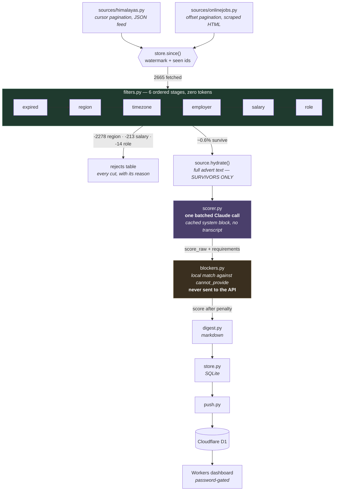

# joblist

Finds the remote jobs that will actually hire you, and pay.

Job boards are full of listings labelled "remote" that will not hire you. They
want a US resident, or an overlap with Pacific time, or they pay a local band.
Reading past those by hand is the whole cost of a job hunt.

`joblist` pulls the feed, throws away everything you are ineligible for using
the board's own structured fields, and spends a language model only on the
handful left over.

## Why it is built this way

On a measured 300-job sample from Himalayas on 2026-08-24, filtering on hiring
region and required timezone alone removed **97.7%** of listings — for zero
tokens, because those are just fields. A representative run:

```
2400 fetched  -2310 region  -1 employer  -9 salary  -66 role  14 to score
```

So the model is not a filter. It is a ranker for the ~0.6% that survive, and
it reads the parts a field cannot capture: a listing with an empty
`locationRestrictions` whose description turns out to be Spanish-language and
LATAM-only, or a "worldwide" role that is really a staffing agency placement.

That division is the entire design. Deterministic where the data is
trustworthy, model where it demonstrably lies.

### The pipeline

Every stage before `scorer.py` is deterministic and costs nothing. The model is
the last thing reached, and it only ever sees what survived.



Three things in that picture are the whole design:

- **The model sits at the bottom, not the top.** Region and timezone alone
  remove 97.7% using fields, so the expensive stage only ever reads the
  remainder. Moving work up into `scorer.py` is the v1 mistake.
- **`hydrate()` runs after the funnel, never before.** Fetching each advert's
  own page at fetch time would spend a request on every listing the salary
  floor discards for free, which is 20+ minutes at a 5s crawl delay.
- **`blockers.py` never touches the API.** The model reports what a posting
  *asks for*; matching that against what you cannot supply happens locally. So
  the list never leaves the machine, and editing it re-prices the entire stored
  history with zero API calls.

### An earlier version of this repo did the opposite

v1 (commit `c143977`) handed the whole job to an agentic loop: a tool the model
had to call exactly once, then a scoring tool it had to call per job, then a
compile tool. That is a `for` loop with an API bill. It also grew a transcript
it resent every turn, so cost scaled quadratically with the number of jobs, and
the final digest could truncate into nothing. It never completed a run.

The rewrite keeps the model and deletes the ceremony.

## Prerequisites

- Python 3.12+
- An Anthropic API key (only for scoring — `--no-llm` runs without one)

## Setup

```bash
pip install -r requirements.txt
cp profile.example.yaml profile.yaml
```

Then edit `profile.yaml`. It holds your timezone, your rate floor, the regions
that can hire you, the titles you want, and any employers you would rather not
see. It is gitignored and never leaves your machine.

Point `scoring.resume_path` at a plain-text or markdown copy of your CV, and
put your key in `.env`:

```
ANTHROPIC_API_KEY=sk-ant-...
```

## Usage

```bash
py main.py                  # fetch, filter, score, write today's digest
py main.py --no-llm         # filters only, no API key needed
py main.py --dry-run        # run everything, persist nothing, print to stdout
py main.py --explain        # print every rejection and why
py main.py --since 72h      # override the watermark
py main.py --json           # also emit results as JSON on stdout
py main.py --fast           # score with the cheaper model
```

There is no `--daily` flag. Point your OS scheduler at `py main.py` — the tool
tracks its own watermark from the last successful run, so a missed day is
caught up automatically rather than silently skipped.

### Drafting a cover letter

Once a listing is worth applying to, draft the letter against the advert that
was actually stored:

```bash
py cover.py <uid>           # one job; a unique uid prefix works
py cover.py --top 5         # the five highest-scoring stored jobs
py cover.py <uid> --dry-run # print the prompt, call nothing, cost nothing
py cover.py <uid> --force   # redraft over an existing file
```

Drafts land in `data/covers/<uid>.md`, are never sent anywhere, and open with a
banner saying so. If the posting asks for something in your `cannot_provide`
list, the file says that first, before you spend time editing prose for a job
you cannot apply to.

**This is deliberately not part of `py main.py`.** A run scores every survivor
because ranking is what makes the digest worth opening. A letter is only worth
writing for a posting a human has already chosen, so drafting one per scored
job would spend a long call on the ones that never get sent. That is the same
mistake `filters.py` exists to avoid at the other end of the funnel.

The model is told, in the system block, to claim nothing the resume does not
evidence, and to write "NO STRONG MATCH:" instead of a letter if the resume
does not support the application. Treat both as best effort, not a guarantee:
the banner on every draft says to read it before sending, and it means it.

## Output

A markdown digest at `data/digest/YYYY-MM-DD.md`:

```markdown
# Job digest — 2026-08-24 09:05 UTC

`244 fetched  -238 region  -1 employer  -3 role  2 to score`

## No matches above 60

2 job(s) were scored but none cleared the threshold:

- **30** (Hudson Manpower) — Backend Developer Level III — Requires 8-10+ years
  of production Kubernetes/Azure work that does not match this profile.

## Near misses

Rejected latest in the chain — the most informative cuts.

- `role` **Operations Coordinator (part-time)** — title matches no target role
- `employer` **Home-Based Accounting Coordinator** — blocklisted employer
- `region` **Founding AI Training Partnerships Manager** — hiring limited to United States
```

The funnel line and the near misses are load-bearing, not decoration. With a
real rate floor, **most days legitimately return nothing**. An empty list with
no explanation reads as a broken tool, and a tool that looks broken stops
getting opened. Showing where the cut happened is usually more useful than the
matches.

## Project structure

```
main.py                CLI and run orchestration
config.py              constants, the requirement vocabulary, the user agent
targeting.py           loads profile.yaml into a Profile
filters.py             the deterministic funnel — the heart of it
scorer.py              one batched Claude call per group of survivors
cover.py               on-demand cover-letter draft for one stored job
blockers.py            local match of asks against what you cannot supply
report.py              what employers keep asking for, tallied over history
digest.py              markdown rendering
store.py               SQLite: seen ids, watermark, runs, rejects, advert text
push.py                ships scored rows to the D1 dashboard
sources/
  base.py              Job model and the Source protocol
  himalayas.py         cursor pagination over the Himalayas JSON feed
  onlinejobs.py        offset pagination, scraped HTML, salary normaliser
dashboard/             Cloudflare Worker + D1, password-gated read-only view
examples/              sample digest and resume, for the bundled demo profile
fixtures/              committed API captures, so tests run offline
tests/                 132 offline, 3 live
docs/
  how-this-was-built.md   the agent-delegation method behind the repo
```

How the repo itself is built, and the control structure around the coding
agents that write most of it, is documented in
[`docs/how-this-was-built.md`](docs/how-this-was-built.md).

### Adding a source

Implement `fetch(since) -> Iterator[Job]` and set `regions_authoritative`.

That flag is the one that matters. Himalayas publishes hiring regions you can
reject on. We Work Remotely does not: a listing marked
`<region>Anywhere in the World</region>` was found to say, in its description,
*"we are only able to hire employees residing in British Columbia or Ontario."*
A source that lies must set the flag `False` so its region field informs the
model instead of silently deleting jobs.

## Testing

```bash
py -m pytest -m "not live"    # offline, deterministic, runs on fixtures
py -m pytest -m live          # hits real APIs, asserts shape only
py -m ruff check .
```

The live tier deliberately asserts **no** counts, titles or specific jobs —
only the response shape the parser depends on. Himalayas deprecated its
`offset` parameter on 2026-08-21 with no notice, so upstream drift is expected
rather than exceptional, and that test is how you learn about it before the
morning run does.

## Troubleshooting

**`python: command not found`, or Python opens the Microsoft Store.**
On Windows, `python` often resolves to the Store alias stub at
`%LOCALAPPDATA%\Microsoft\WindowsApps\python.exe`. Use `py` instead.

**`UnicodeEncodeError` writing the digest.** The tool forces UTF-8 on stdout
and stderr at startup. If you are piping through another script, that script
needs the same.

**`profile.yaml not found`.** Copy `profile.example.yaml` and edit it.

**Everything is rejected at `region`.** Expected — that stage removes ~95% by
design. Run `--explain` to see the reasons, and check `regions.allow` in your
profile actually lists how the board spells your region.

**Nothing is ever returned at all.** Check the salary stage in `--explain`. A
salary filter that treats "not stated" as "below floor" rejects the majority of
the market; this one deliberately passes unknowns through to scoring.

## Licence

MIT. See [LICENSE](LICENSE).
