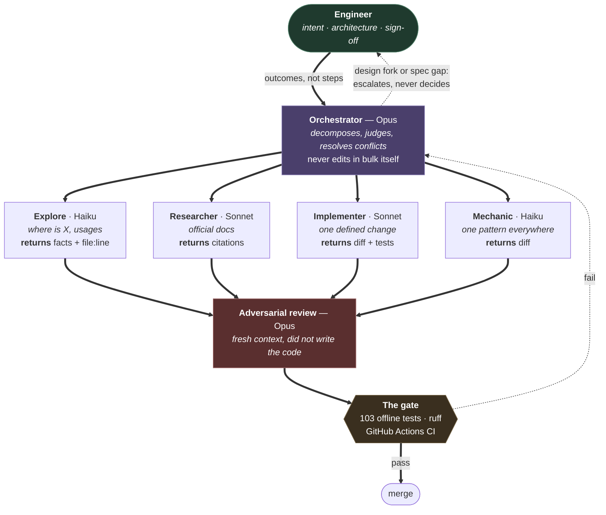

# How this repo is built

`joblist` is written by one engineer directing a tier of coding agents, and
reviewing everything they produce. This page documents that working method,
because "built with AI agents" means very little without the control structure
around it.

The same idea governs both the tool and the process: **let the cheap
deterministic thing do as much as possible, and spend the expensive model only
where judgment is genuinely required.** In the tool, that is `filters.py`
before `scorer.py`. In the process, it is the routing below.

## The control structure

## The four rules that make it work

**Workers return facts, never transcripts.** A search agent returns
`filters.py:114, stage_salary is tri-state` and nothing else. Returning file
dumps or narration defeats the purpose, because the orchestrator's context is
the scarce resource being protected.

**Decisions come home.** When a worker hits a spec gap or a design fork, it
reports it rather than choosing. Every architectural call in this repo, the
tri-state salary rule, the decision to hydrate after the funnel rather than
before, keeping `cannot_provide` out of the prompt, was made at the top and
handed down as a constraint.

**Review is adversarial and has no memory of the work.** The reviewing pass
runs in a fresh context and did not write the code, so it cannot be persuaded
by its own reasoning from an hour earlier.

**The gate is mechanical, not conversational.** Nothing merges because an agent
said it was finished. It merges because 103 offline tests and `ruff` pass in
CI. Agents are fast and confidently wrong; the test suite is the thing that
does not care how confident anyone was.

## Where it went wrong, which is the useful part

The first version of this tool was itself an agentic loop: a model calling a
fetch tool once, a scoring tool per job, then a compile tool. It grew a
transcript it resent every turn, so cost scaled quadratically with the number
of jobs, and it **never completed a single run**. That commit is still in the
history.

The rewrite deleted the loop and kept the model as a ranker. The lesson
generalises to the process above: an agent is worth reaching for when the task
needs judgment on unstructured input, and is the wrong tool when the task is a
`for` loop with an API bill attached.

Two later bugs make the same point about the gate. A currency regex using `\b`
missed `25,000PHP` and read pesos as dollars, overstating one wage by about
58x. And one board was being scored on a 280-character truncated teaser rather
than the full advert. Neither was caught by reading the code. Both were caught
by measuring the output and then written into `tests/` so they cannot return.
